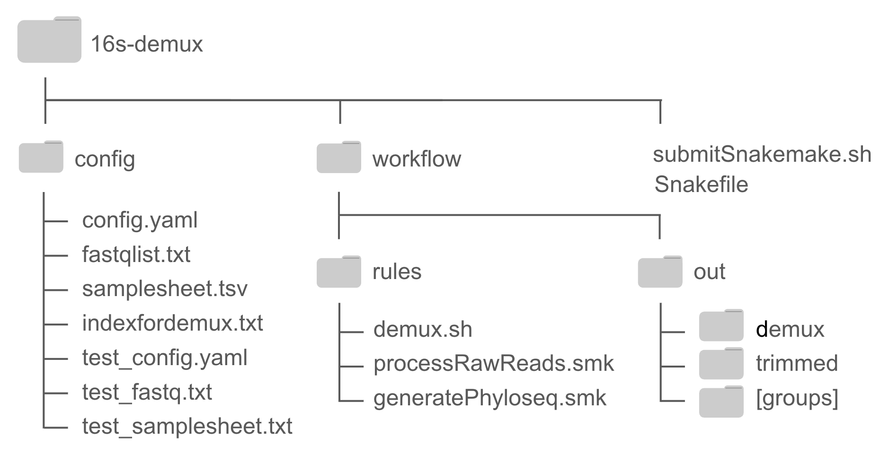
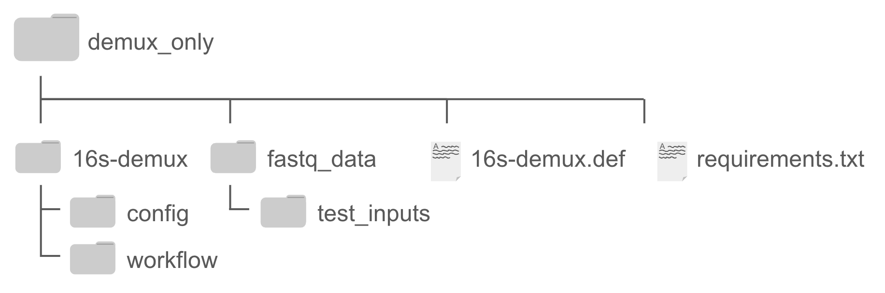

# 16S-dual-index
Code for demultiplexing sequencing data generated using our Nova/Nex/MiSeq dual indexing

READ ME:
The following document describes how to use the Docker and Singularity/Apptainer images to use our demultiplexing code. By using these containerization platforms, users can avoid the time consuming process of installing dependencies and configuring environments. 

## Using Docker
To analyze our code to analyze dual-indexed sequencing data, first ensure that Docker is installed. Docker is a handy platform for sharing not only code but also coding environments, which enables easy code sharing without hours of installing dependencies. You can find instructions on Docker installation here {https://docs.docker.com/engine/install/}. Once Docker is installed, open the Docker desktop application or run ‘systemctl start docker’ to launch the Docker Daemon. 

1. **Installation and setting up the Docker image** \
  There are two ways to acquire the docker image needed for analysis, either by pulling directly from docker hub (the easiest approach) or using the dockerfile and other inputs provided in 'XXX.zip' to build the docker image.\
  **Pulling image:** \
  Launch Docker. Then in a terminal, run `docker pull XXX`. This will make a local copy of the Docker image XXX, which contains the code and environment needed to process the data, as well as example input files for running a test.\
  **Building image:**\
  Instead of pulling the docker image from the Docker hub, the docker image can also be built from the Docker file. This process takes much longer and is not recommended, but is described in the >Building images section below. 

2. **Run the test analysis**
  To check that the set up was successful, run a quick analysis using provided test data. Start by running\
  `docker run -it XXX`\
  to open a container from the image XXX in an interactive mode (specified by the flags -it). In this mode, we can enter a series of commands, step by step within this container. All of the necessary input files are already included within the container, so no files need to be imported. To run the test, navigate to the 16S-demux-edits directory and edit 'Snakefile’ so that line 4 reads:\
  `configfile: "config/test_config.yaml"`\
  rather than:\
  `configfile: "config/config.yaml"`\
  If line 4 already reads\
  `configfile: “config/test_config.yaml”`\
  then no edit is necessary. Next, run:\
  `snakemake --cores 1`\
  This should take about 6 minutes, and will run a test analysis using ‘config/test_fastq.txt’, ‘config/test_samplesheet.txt’ and test files included in /fastq_data/test/. The output files will be generated in the ‘workflow/test_out/’ directory. If the run is successful, the following outputs should be generated in ‘workflow/test_out/trimmed’:\
  If these files are generated in ‘trimmed’, the run has been successful! Details on intermediate files are included below in the __Test run full outputs__ section.\
  To exit the container, simply type ‘exit’.

3. **Run the actual analysis**\
  From outside of the container, ***Move any files that are needed in?***\
  Next, run:\
  `docker run -it XXX`\
  to open a container from the image XXX in an interactive mode. Once we are in the interactive container and have all of the necessary files available, we can start the analysis. Below, we’ll go step by step through the process for the test data. Details on supplying inputs for your actual analysis are included below in >Inputs.\ 
  Navigate to the 16S-demux-edits directory and if necessary, edit line 4 so that it reads:\
  `configfile: “config/config.yaml”`\
  rather than\
  `configfile: “config/test_config.yaml”`\
In the ‘config’ directory, update ‘config.yaml’ so that `samplesheet:` and `fastqlist:` in lines 2 and 4 are followed by the paths to your input samplesheet and fastqlist, respectively (more details in the __Inputs__ section). If you are using custom primers or indexes, you may need to adjust the input file for ‘indicies:’ or the lengths of read1 and read2 indexes and primers (lines 3, 5, 6, 7, 8). For more details on custom primers, see the __Custom Primers__ section.\
Once the inputs and paths are updated, run:\
`snakemake --cores 1`\
within the 16S-demux-edits directory. The analysis time will vary with the number and size of input files. However, XXXestimatesXXX. If the run is successful, a message similar to that below should be output:
4. **Clean Up**\
After the run is completed and outputs have been moved out and saved, exit from the container. The remnants of the container created can be removed with the following code:\
`docker rm  [container name]`\
This will not remove the image - only the container that was just now built using this image. Be sure any important data or intermediates are transferred out of the container before removing it.\
__Note:__ Before starting the actual run, you can use the command ‘snakemake -n’ to do a dry run. This is helpful for ensuring that names and file locations are correct before starting the full run. 

## Using Singularity/Apptainer
Most HPC are not compatible with Docker use, but do support Singularity/Apptainer. To run using Apptainer, follow these steps:

1. **Setting up the Singularity/Apptainer image**\
   First, ensure that Singularity/Apptainer is installed. The pre-built Singularity image is not currently available for direct download, but the Singularity image can be built locally fairly quickly ( ~10 minutes) and only requires that some specific files be made available locally. Instructions are included in the ‘Building Images’ section below. Once the build is successfully, you should have a file named ‘demux-image.sif’ in the directory from which it was built.

3. **Open a shell in the container**\
   To open a shell, run the following command from the directory containing the ‘demux-image.sif’:\
   `Singularity shell demux-image.sif` \
   This will bring you to a shell within the container where you can interactively run processes.\
   __Note:__ Depending on your HPC system, you may need extra resources to work in the shell, so it is not recommended that you do this on a login node. You can use a compute node, or allocate resources using a job manager. An example Slurm script is included in the 16S-demux_edits directory, entitled ‘submitSnakemake.sh’. 

4. **Run the test analysis**\
   To check that the set up was successful, run a quick analysis using provided test data. To do this, edit the Snakefile so that line 4 reads:\
  `configfile: "config/test_config.yaml"`\
  rather than:\
  `configfile: "config/config.yaml"`\
  Then run:\
  `snakemake --cores 1`
  within the ‘16S_demux_edits’ directory. This should take about 16 minutes depending on your system, and will run a test analysis using ‘config/test_fastq.txt’,   ‘config/test_samplesheet.txt’ and the test files included in /fastq_data/test/. The output files will be generated in the ‘workflow/test_out/’ directory. If the run is successful, the following outputs should be generated:\
   *image of outputs here...*\
  If these files are generated in ‘trimmed’, the run has been successful. Details on intermediate files are included below in >Test run full outputs.\
  To exit the container, simply type ‘exit’.

5. **Run the actual analysis**\
  To run the actual analysis, ensure your input files are accurate and located in the correct directory (see >Inputs for details), and ensure that the paths within ‘config/config.yaml’ are correct. Next edit the Snakefile so that line 4 reads:\
  `config/config.yaml`\
  rather than:\
  `configfile: "config/test_config.yaml`.\
  If you aren’t using a job manager like slurm, you can use the command:\
  `snakemake --cores 1`\
  in the 16S-demux-edits directory to start the analysis. If you are using a job manager, you will need to submit a job to run this command. An example script “submitSnakemake.sh” is included, which will launch an interactive shell within the container and run the entire snakemake pipeline.\
  __Note:__ To use this submission script, be sure to change the SBATCH parameters at the top as needed, and ensure that the image name in the line:\
`singularity shell ../demux-image.sif`\
matches the image name from your build. The analysis time will vary with the number and size of input files. Fully processing a run with 288 fastq.gz files with average size 22 MB with 24 cores took XXX. If the run is successful, a message similar to that below should be output:\
*example output*.\
__Note:__ Before starting the actual run, you can use the command `snakemake -n` to do a dry run. This is helpful for ensuring that names and file locations are correct before starting the full run. 

## Inputs
In addition to the sequencing data itself, there are two input files needed for demultiplexing: a fastq file list, and a sample sheet. Additionally, the included config.yaml file will need to be edited.\
The general file structure created by the Docker/Singularity images is shown below. Within the main folder (16s-demux), there are two important folders, config and workflow. The code for running the analysis is stored in workflow/rules, and outputs are generated within workflow/out/. Test files and most input files are found within the config folder.\
Test files are included within config (‘test_config.yaml’, ‘test_fastq.txt’, ‘test_samplesheet.txt’), and the official config.yaml file, fastq file list, and samplesheets should also be included in the config folder. Here the fastq file list and samplesheets are named ‘samplesheet.tsv’ and ‘fastqlist.txt’, but the names can vary. The indexfordemux.txt file, which includes the unique in-line indices. 

The script for initiating the Snakemake run using Slurm and the Snakefile encoding the analysis are found in the top 16s-demux file. 
 

1. **Fastq data:**\
  **Names:** Sample names should not include any spaces or underscores (hyphens are fine). If they do, they should be renamed before demultiplexing.\
  **Format:** Files should be formatted as gzipped fastq files, or “.fastq.gz” files.\
  **Location:** If the demultiplexing will be run locally or on a server, fastq files just need to be somewhere on that server. The paths to fastq files are defined by the entries included in 
the fastq file list and the config.yaml variable ‘fastqdir’. If the absolute path to the fastq files is provided in the fastq file list, then the fastqdir variable in config.yaml should be an empty string (“”). Otherwise, the ‘fastqdir’ path from config.yaml concatenated with the path in the fastq file list is correct.\
  For example, the file “/home/users/TEST/sequencing/exp01/fastqs/TEST_R1_001.fastq.gz” could be accurately described with the following combinations (and plenty others!):

| fastqdir:	(set in config.yaml) |	fastq file list: | 
| --- | --- |
| “”	|	“/home/users/TEST/sequencing/exp01/fastqs/TEST_R1_001.fastq.gz” |
| “/home/users/TEST/sequencing/exp01/fastqs/”	| “TEST_R1_001.fastq.gz” |

2. **Fastq file list:**\
  **Location:** The fastq file list should be located within the ‘config’ directory, and the file name should be updated in the fastqlist field of the ‘config.yaml’ file, (unless it is named ‘fastq.txt’, which is the default). 
   **Contents:** The fastq list should be a tab-delimited text file, with the first column including the path to read 1, the second column including the path to read 2, and the final column including the shortened file name. This table should have headers of ‘read1’, ‘read2’, and ‘file’. For the file name, we recommend a format such as “{RunName}-{round2plate}-{well}”, where ‘RunName’ can be anything without underscores or spaces, and the next two terms specify the plate identifier for the round 2 barcodes and the well number respectively. It is essential that the ‘file’ field in the fastq file list matches the first part of the ‘filename’ field in the Samplesheet.\
  The fastq file list for the test files is shown below:

| read1					|	read2					|	file |
| ------| ----| ---- |
| /fastq_data/test_inputs/15mc_002_plates1-4_well01_S865_R1_001.fastq.gz	| /fastq_data/test_inputs/15mc_002_plates1-4_well01_S865_R2_001.fastq.gz	| 16S-J-A01 |
| /fastq_data/test_inputs/15mc_002_plates1-4_well02_S866_R1_001.fastq.gz	| /fastq_data/test_inputs/15mc_002_plates1-4_well02_S866_R2_001.fastq.gz	| 16S-J-A02 |
| /fastq_data/test_inputs/15mc_002_plates1-4_well03_S867_R1_001.fastq.gz	| /fastq_data/test_inputs/15mc_002_plates1-4_well03_S867_R2_001.fastq.gz	| 16S-J-A03 |
| /fastq_data/test_inputs/15mc_002_plates1-4_well04_S868_R1_001.fastq.gz	| /fastq_data/test_inputs/15mc_002_plates1-4_well04_S868_R2_001.fastq.gz	| 16S-J-A04 |

3. **Samplesheet:**\
   **Location:** The samplesheet should be included in the ‘config’ directory, and (unless it is named ‘samplesheet.txt’) the ‘samplesheet’ path in the ‘config.yaml’ file should be updated to reflect the samplesheet’s name. 
  **Contents:** The sample sheet will contain metadata for all the samples as a tab-delimited table. This file should contain a header as the first row, and must include the following columns: ‘filename’, ‘sample’, and ‘group’. Additional columns can be included in the table. For example, the test samplesheet has columns ‘No’, ‘Screen’, ‘Plate’, ‘Well’, ‘PlateName’, ‘Media’, ‘Capsule’, ‘PlateDescription’, ‘Treatment’, ‘Tissue’, ‘Isolator’, ‘Subject’, ‘CollectionDate’, ‘round1index’, ‘round2plate’, ‘sample	group’, ‘filename’. Any extra column names can be included as desired, but ‘filename’, sample’ and ‘group’ are necessary.\
  The ‘sample’ column should contain the name that each individual sample will take after demultiplexing, and should not contain underscores.\
  The ‘group’ column can contain any group identifier (should not contain spaces or slashes). Samples in different groups will be output into different subdirectories within the ‘trimmed’ directory at the end of the run. If you don’t need reads separated, use one group specifier for all samples, or just leave the column blank (but do keep the ‘group’ header).\
  The ‘filename’ column should have the format:\
  `{RunName}-{round2plate}-{well}-L{round1index}`\
  with the ‘{RunName}-{round2plate}-{well}’ portion matching the corresponding ‘file’ entries in the fastq file list. Some of the columns from the test sample sheet are shown below:

| No	| Screen	| Plate	| Well	| PlateName	| round1index	| round2plate	| sample | group	| filename |
| ----- | ----- | ----- | ----- | ----- | ----- | ----- | ----- | ----- | ----- | 
| 1	| 15mc002	| P1	| A01	| P1D2	| 4	| J	| P1-A01-PCRnegative-0	| A	| 16S-J-A01-L4 | 
| 2	| 15mc002	| P37	| A02	| P1D2	| 4	| J	| P37-A02-liquidTT8	| A	| 16S-J-A02-L4 | 
| 3	| 15mc002	| P37	| A03	| P1D2	| 4	| J	| P37-A03-15m-equal-inoc.	| A	| 16S-J-A03-L4 | 
| 4	| 15mc002	| P37	| A04	| P1D2	| 4	| J	| P37-A04-15m-stable-inoc.-	| A	| 16S-J-A04-L4 | 

## Building Images
### Docker:
To build a Docker image, ensure the necessary field are arranged properly, and build from the Dockerfile:
1. All necessary files are included in ‘Demux only files.zip’ in **location**. Download and unzip the file. The following file structure should be created:
Within the main directory:

Within 16s-demux:

‘Dockerfile’ and ‘requirements.txt’ are needed for the building process, and the fastq_data directory contains example data for the test. All of the code is contained within the ‘16s-demux’ directory, and outputs will be generated there as well.
2. __Note:__ This step will likely require more resources than are available on a HPC login node, so be sure you are on a compute node or use a job manager to allocate resources. 
Move to the directory containing the Dockerfile and run the following:
‘docker build -t {name}:{version} .’
The image will be created locally with the name and version provided following -t. The build should take a few minutes, and if it is completed successfully, the the final output will look something like this:

3. Now that the image has been build, you can run the demultiplexing analysis within it using the command ‘docker run -it {name:version}’

### Singularity/Apptainer:
To build a singularity/Apptainer image, ensure the necessary files are arranged properly and build from the Def file:

1. All necessary files are included in ‘demux_only.zip’ in **location**. Download and unzip the file. The following file structure should be created:
 
‘16s-demux.def’ and ‘requirements.txt’ are both needed for the building process, and the fastq_data contains example data for the test. All of the code is contained within the ‘16S-demux’ directory, and outputs will be generated there as well.
3. __Note:__ The following step will likely require more resources than are available on a HPC login node, so be sure you are on a compute node or use a job manager to allocate resources. Move to the directory containing the def file (16s-demux.def) and run the following:
`singularity build {image name}.sif 16s-demux.def`
The image will be created locally and a file ‘Name.sif’ will be created in the current working directory. The build should take less than 10 minutes, and if it is completed successfully, the the final output will look something like this:
Once completed, the file {image name}.sif should be included in the current working directory.

4. Now that the image has been built, you can run the demultiplexing analysis within it as described in ‘> Using Singularity/Apptainer’ using the image ‘Name.sif’. 

# Sections below are under construction! Please ignore!

## Custom Primers
The instructions and code above all assume the primers and indexes used are the standard ones presented in Xthe paperX. If custom primers/indexes are used, several changes will need to be made.

1. Update config/indexfordemux.txt
This file contains the indexes used for demultiplexing round 1 indexes. As a reminder, the indexes have variable lengths or ‘phases’ as shown in the table below:

| phase | variable FP | variable RP |
| --- | --- | --- |
| 0 |  |ATGGACT |
| 1 | T | GCTAGC |
| 2 | GG  | TGACT |
| 3 | ACT | CGGT |
| 4 | TAAC | GTA |
| 5 | CAGTC | AA |
| 6 | ATCGAT | C|
| 7 | GCAAGTC  | |
 

However, during the demultiplexing, we treat the reads as if they have 7 base pair indexes on both ends. Any of the 7 base pairs that are not filled in with the index will be the spacer/gene-specific primer sequence. The table below shows the default indexes, with the actual index base pairs underlined, the spacer base pairs highlighted in blue, and the gene-specific primer regions in yellow. (The ‘bc’ or barcode column is simply the concatenated strings of read1index and read2index). The index, spacer, and gene specific regions will need to be edited according to the changes in primers. 

| phase | read1index | read2index | bc |
| --- | --- | --- | --- |
| 0 | CAGTAGA | ATGGACT | CAGTAGAATGGACT | 
| 1 | TCAGTAG | GCTAGCA | TCAGTAGGCTAGCA | 
| 2 | GGCAGTA | TGACTAT | GGCAGTATGACTAT | 
| 3 | ACTCAGT | CGGTATC | ACTCAGTCGGTATC | 
| 4 | TAACCAG | GTAATCC | TAACCAGGTAATCC | 
| 5 | CAGTCCA | AAATCCT | CAGTCCAAAATCCT | 
| 6 | ATCGATC | CATCCTA | ATCGATCCATCCTA | 
| 7 | GCAAGTC | ATCCTAC | GCAAGTCATCCTAC | 

__Note:__ We highly recommend avoiding any mixed base characters such as ‘W’ or ‘N’ in the first three positions of your gene specific primer! If such bases are included, you will need to make several version of the indexfordemux.txt table, one for each potential base (e.g., for a ‘W’, one version should have an ‘A’ and one should have a ‘T’). The demultiplexing should be run twice, once for each indexfordemux.txt file. 

2. Update the index lengths in config/config.yaml 
Within the ‘config/config.yaml’ file, the index/primer lengths will need to be updated. The “lenR1index” and “lenR2index” should be set to the longest version of these (e.g., in the provided primer/index set, the longest sequence of index bases is 7, so the value is set to 7). The “lenR1primer” and “lenR2primer” values should be set to equal the length of the gene-specific primer sequence plus the length of the spacer. 

## Test run full outputs
Within ‘workflow’, there should be a ‘test_out’ directory with ‘demux’ and ‘trimmed’ directories:

Under ‘demux’, there should be four sets of 3 files; each should have 1 *.extract.log file, and 2 .fastq.gz files. There should also be two directories: ‘R1’ and ‘R2’:

The contents of ‘R1’ and ‘R2’ should have the same filenames (but correspond to forward and reverse reads for the specified sample). For each sample in the above, there should be 8 files, ending with ‘-L*.fastq.gz’, where * is an integer from 0 to 7:

Within the ‘trimmed’ directory, there should be a subdirectory ‘A’, and within there, there should be directories ‘R1’, ‘R2’, ‘removed’, and two summary files: ‘lowReadsSummary.txt’, and ‘summary.txt’: 

If these files are generated in ‘trimmed’, the run has been successful!
## Running in a virtual machine
To demultiplex within a virtual machine, use the Docker instructions above. Additional steps will be needed to import files into the VM for analysis. The files needed will include:
The fastq file list
The sample sheet
Sequencing data (in fastq.gz format)
???

